# 使用Addressable进行增量更新的操作流程

## 准备工作
--------------------
+ 使用PackageManager导入Addressables包
+ 导入[AddressableImport](https://github.com/favoyang/unity-addressable-importer)插件

--------------------
## Addressable的设置项

1. ###  Profiles设置
    + 点击Unity工具栏Window->AssetManagement->Addressables->Profiles打开Profiles设置面板
    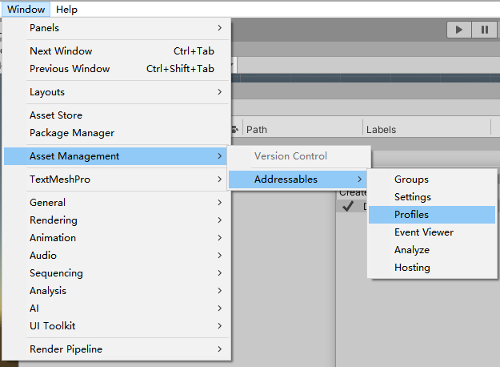

    + 修改LoadPath和BuildPath(点击左上角Create可创建多个模板), LocalBuildPath和LocalBuildPath无特殊需求一般保持默认即可，RemoteBuildPath改为Build资源后需要存放的目录(打完资源包后需要将资源拷贝到RemoteLoadPath能够访问到的地址)RemoteLoadPath改为从远端下载资源的地址
    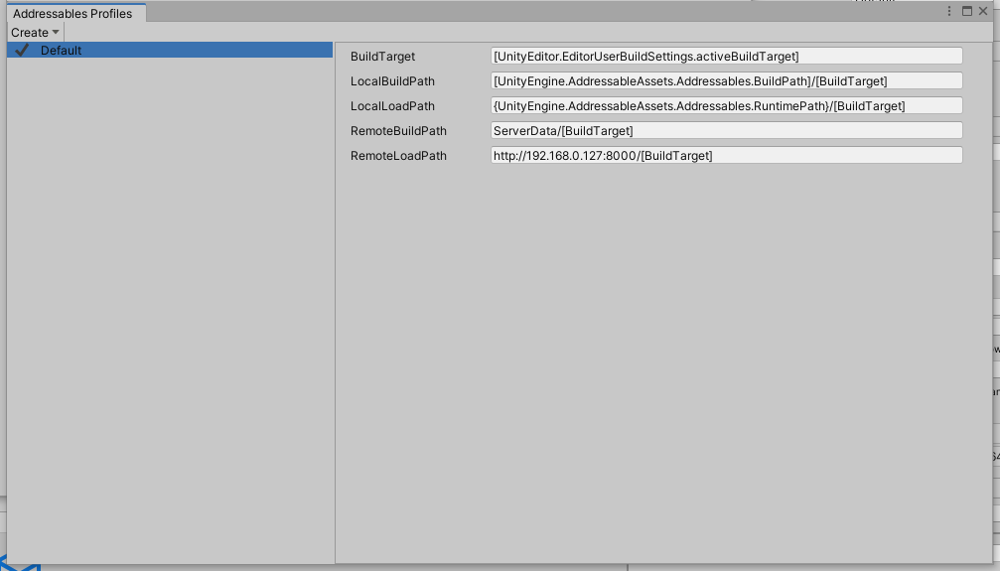

2. ### Addressable设置
    + 点击Unity工具栏Window->AssetManagement->Addressables/Settings打开Addressable的设置面板
    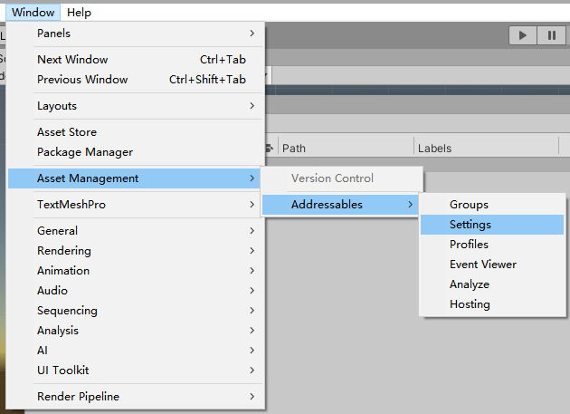

    + 在Inspector视窗找到ContentUpdate栏，关闭将DisableCatalogUpdateOnStartup设为true禁止启动时自动更新

    + BuildRemoteCatalog设为true(无论是增量还是全量更新都必须要设置此项) 勾选后将BuildPath和LoadPath设置为之前设置的Remote地址
    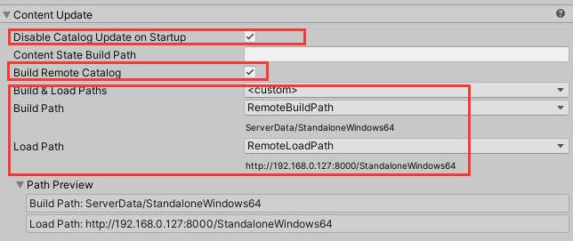

3. ### 新建Group模板文件
    + 在Assets/AddressableAssetsData/AssetGroupTemplates目录右键Create->Addressables->GroupTemplates/BlankGroupTemplate创建一个新的模板文件(或直接修改此目录下的默认模板文件)
    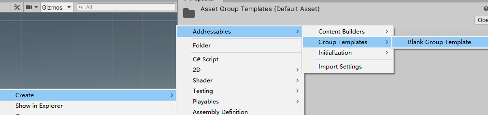

    + 修改ContentPacking&Loading中的路径为LocalPath(如果是新建的空白模板点击最下面的AddSchema添加主题，下同)

    + 检查ContentPacking中的IncludeInBuild是否为true，如果不是改为true

    + 修改ContentUpdateRestriction中的UpdateRestriction为CannotChangePostRelease(即静态组，表明此组在发布之后不允许修改，只有设为静态组才能进行增量更新，否则为全量更新)
    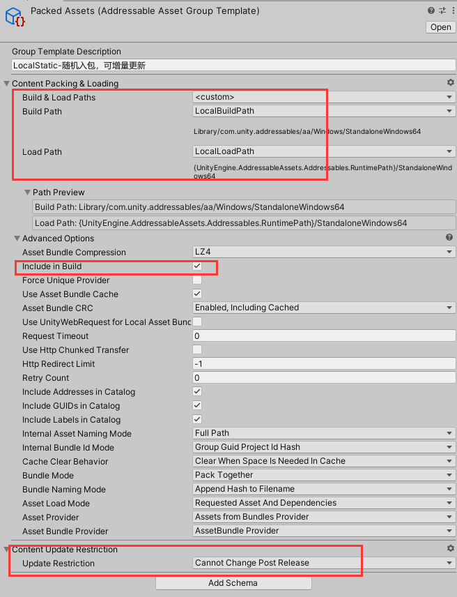

    + 在Addressable设置步骤中的AddressableSettings中找到AssetGroupTemplates栏点击加号选择刚刚添加的模板将模板加入到设置中

## AddressableImport设置

1. 在Assets/AddressableAssetsData目录下右键Create->Addressables->ImportSettings创建ImportSetting
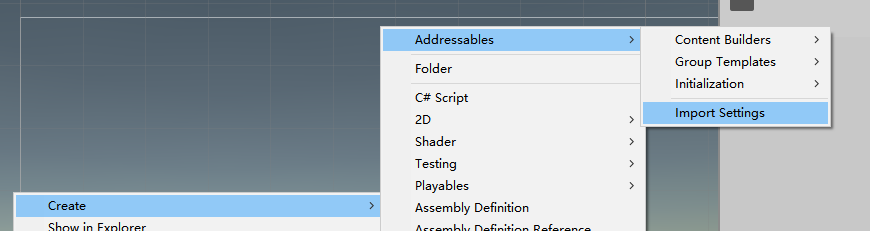

2. 根据自己的项目需求设置分组规则,用于自动将资源分配到Addressable的组中(使用方法参见[官方文档](https://github.com/favoyang/unity-addressable-importer/blob/master/Documentation~/AddressableImporter.md))

3. 将添加的规则的GroupTemplate设置为我们前面操作新建的模板，并将GroupTemplateApplicationMode改为AlwaysOverwriteGroupSetting
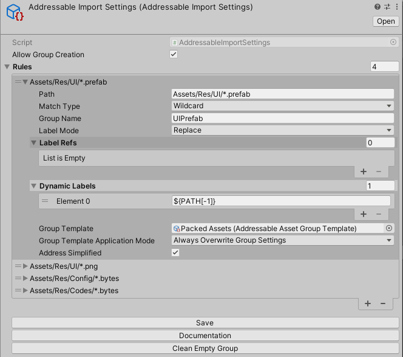

4. 修改完之后记得点击Save保存

## 首次打包

1. 在Asset目录下右键然后点击AddressableImporter:CheckFolder(s)检查设置中匹配到的资源按照设置分组(在首次打包之后不要再点击此按钮，此操作会将所有资源按照定义的规则分配，而后续更新中组的内容会根据每次更新的修改而发生变化，如果后续又进行了此操作仍能更新到最新内容，但可能会导致更新的内容变大)

2. 点击Unity工具栏的Window->AssetManagement->Addressables->Groups打开Groups面板可以看到资源已经按照定义的规则分好组
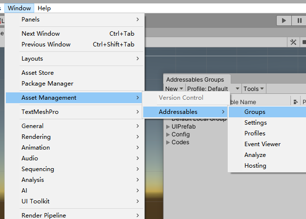

3. 点击右上角Build->NewBuild->DefaultBuildScript构建资源包(只有首次构建才点击此选项打资源包，通过此操作构建的资源不能更新到客户端只有重新构建apk才能正常加载)

4. 资源构建完成后直接Build Apk即可(加载代码，buld apk等不再阐述)

5. 将RemoteBuildPath下的文件拷贝到RemoteLoadPath可以访问到的目录

## 增量更新

1. 需要进行增量更新时点击Group面板的Tools->CheckForContentUpdateRestrictions按钮
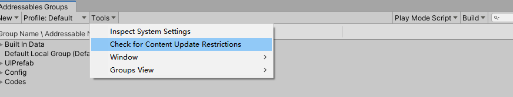

2. 在弹出的窗口中选择build的平台选中对应的.bin文件打开
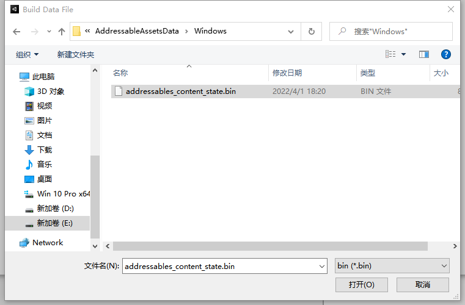

3. 可以在弹出的窗口中看到当前修改过的内容(无内容修改则为空)，点击ApplyChanges
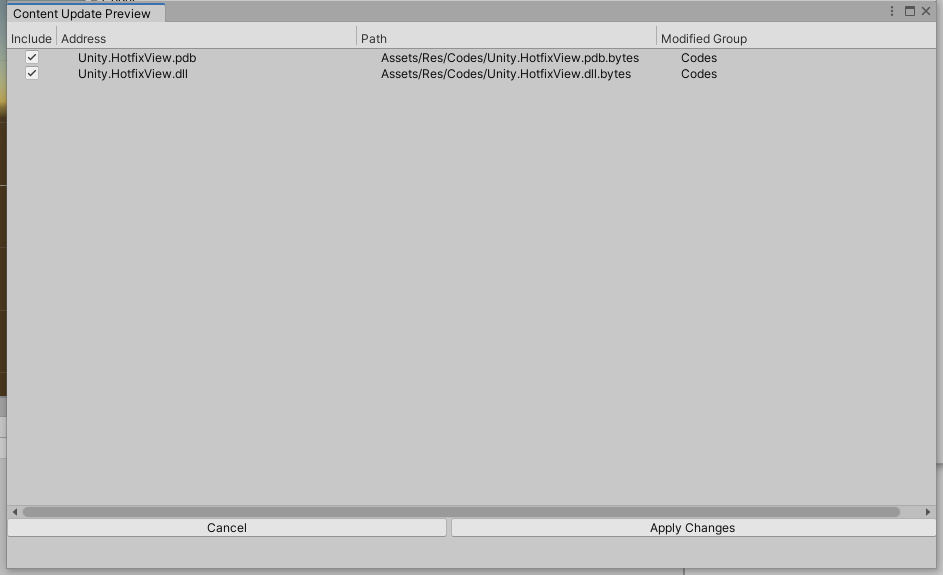

4. 进行上述操作之后可以看到在Group面板多出了一个分组，静态组中修改过的内容被移动到了新的分组，此时选中这个分组在Inspector视窗将ContentPacking&Loading的BuildPath和LoadPath修改为Remote
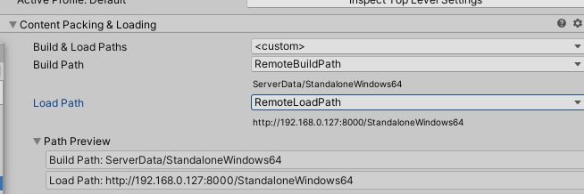

5. 点击Group面板的Build->Update a Previous Build

6. 在弹出的窗口中仍然选中第2步的.bin文件打开

7. 等待Build完成

8. 将RemoteBuildPath下的文件拷贝到RemoteLoadPath可以访问到的目录即完成了增量更新

## 注意事项

+ 不要手动在Group面板修改Group的内容

+ 在构建apk包后不要再执行Import插件的CheckFolder操作，否则在后续的增量更新中会将导致更新内容变大(例如在首次构建时有ABC三个资源在甲Group中，第一次增量更新时修改了A此时A将会被移动到Remote组乙，后续再修改B而A未再次修改的情况下进行增量更新B将会移动到Remote组丙，而A仍在乙组，但若在第二次增量更新前执行了CheckFolder操作乙组的内容将会被重新移动至原始组导致后续的更新中被分配到最新的热更组如丙，此时本应在乙组中的A资源被移动到了丙，导致客户端下载时明明存在最新内容的A但因需要下载丙组的内容而导致要下载本可不用重复下载的A)

